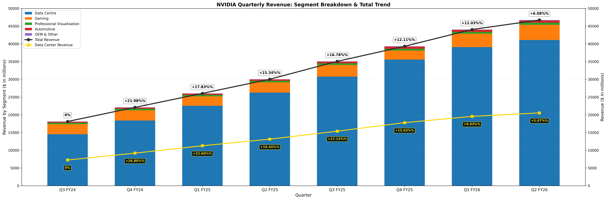
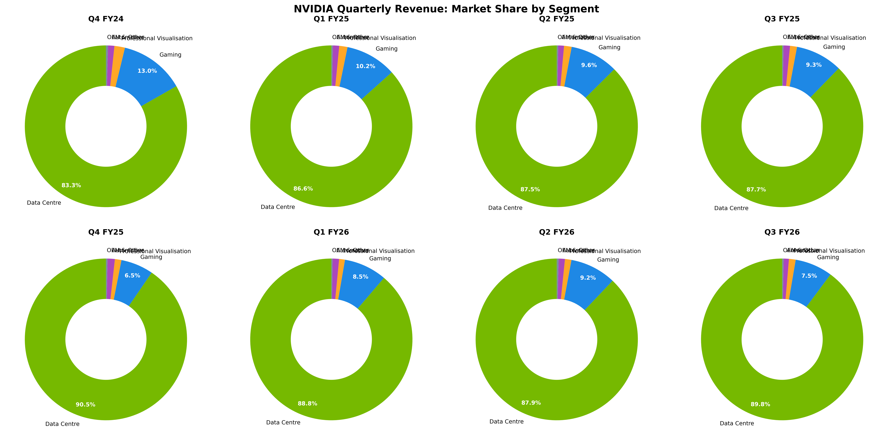
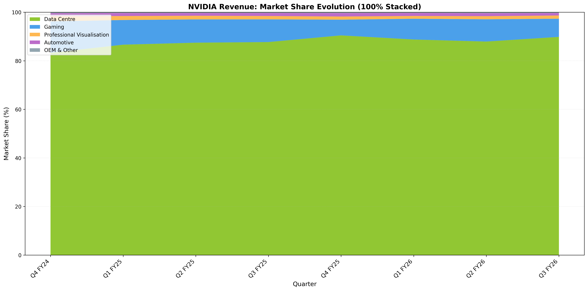
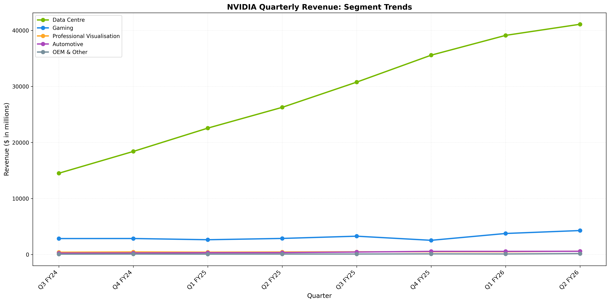
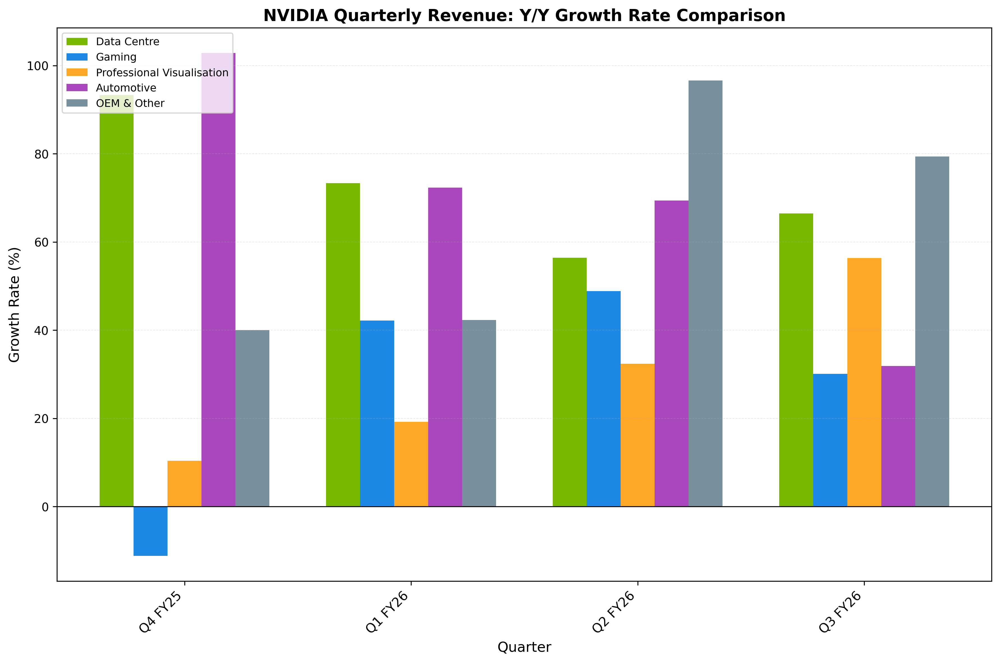
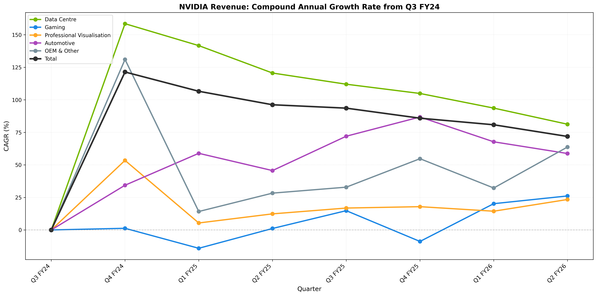
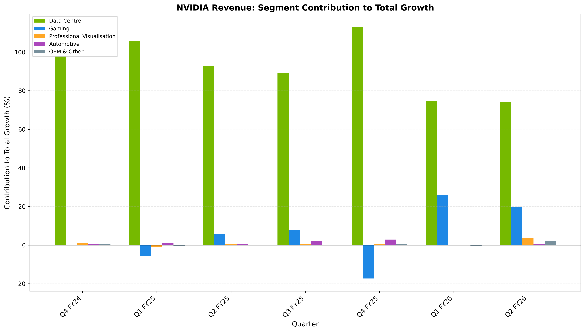
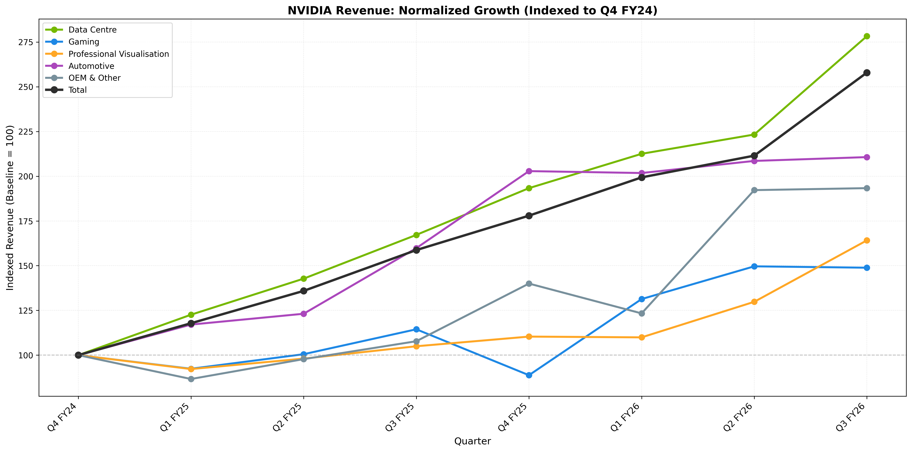

# NVIDIA Quarterly Revenue



A Python tool that extracts and visualises NVIDIA's quarterly revenue data from PDF reports. The tool generates comprehensive charts showing revenue breakdown by market segment with growth rate trends.

## Features

- **Automated PDF Processing**: Automatically detects and processes the latest quarterly PDF from the `data/` directory
- **Comprehensive Chart Suite**: Generates 9 different visualisations for in-depth revenue analysis
- **Market Segment Breakdown**: Analyses revenue across five market segments:
  - Data Centre
  - Gaming
  - Professional Visualisation
  - Automotive
  - OEM & Other
- **Growth Rate Analysis**: Multiple views of Q/Q, Y/Y, and CAGR growth metrics
- **Dynamic Scaling**: Chart widths adjust based on the number of quarters displayed (currently showing all 8 quarters from the PDF)

## Installation

Install dependencies:
```bash
uv sync
```

Or with development dependencies:
```bash
uv sync --all-groups
```

## Usage

Run with a specific PDF file:
```bash
uv run python main.py data/<PDF File>
```

Or run without arguments to automatically use the latest quarterly PDF from the `data/` directory:
```bash
uv run python main.py
```

The script automatically detects the latest file by parsing the quarter and year from filenames (e.g., Q226 = Q2 FY26).

**Note:** PDF files should be placed in the `data/` directory.

### Output

The script generates:
- **Console Output**: Quarter-over-quarter growth rates for total revenue
- **9 Chart Images**: Comprehensive visualisation suite

#### Generated Charts

### 1. Main Revenue Trend (Stacked Bar Chart)

*Stacked bars showing revenue by market segment with total revenue and data centre revenue trend lines with growth rate annotations*

### 2. Market Share Analysis

*Multi-panel pie/donut charts showing percentage breakdown by segment for each quarter - highlights Data Centre's growing dominance*

### 3. Market Share Evolution

*100% stacked area chart visualising relative proportion changes over time and segment market share shifts*

### 4. Individual Segment Trends

*Line chart with separate lines for each segment - makes it easier to compare smaller segments and shows absolute revenue growth trajectories*

### 5. Quarter-over-Quarter Growth Comparison

*Grouped bar chart comparing Q/Q growth rates with side-by-side comparison across all segments - shows which segments are accelerating/decelerating*

### 6. Year-over-Year Growth Comparison

*Grouped bar chart comparing Y/Y growth rates across fiscal years - reveals seasonal patterns and annual trends*

### 7. Compound Annual Growth Rate (CAGR)

*Line chart showing CAGR evolution over quarters - displays annualized growth rate from baseline to each quarter for all segments*

### 8. Growth Contribution Analysis

*Shows each segment's contribution to total growth - highlights which segments drive overall revenue increase as percentage of total growth*

### 9. Indexed Growth Comparison

*All segments indexed to 100 at baseline quarter - shows relative growth trajectories for easy comparison regardless of absolute segment size*

## Development

### Running Tests

```bash
uv run pytest
```

Run a specific test:
```bash
uv run pytest tests/test_replace_text.py::test_replace_spaces
```

### Code Formatting

Format code with Black:
```bash
uv run black .
```

### Pre-commit Hooks

Run pre-commit hooks (trailing whitespace removal, EOF fixes, merge conflict checks):
```bash
uv run pre-commit run --all-files
```

Install hooks to run automatically on commit:
```bash
uv run pre-commit install
```

## Project Structure

```
nvidia-quarterly-revenue/
├── data/                   # PDF files directory
├── main.py                 # Main script for data extraction and visualisation
├── charts.py               # Modular chart generation functions
├── read_pdf.py             # PDF parsing logic
├── utils/
│   ├── calculate_growth_rate.py  # Growth rate calculation
│   ├── find_latest_pdf.py        # Latest PDF detection
│   ├── replace_text.py           # Text formatting utilities
│   └── download_pdf.py           # PDF download automation
├── tests/                  # Test suite
└── *.png                   # Generated chart outputs (9 files)
```

## Automated Workflows

The project includes GitHub Actions workflows for:
- **PDF Monitor**: Automatically checks for new quarterly PDFs and downloads them
- **Testing**: Runs pytest on pull requests and pushes
- **PDF Downloader**: Manual workflow to download specific quarterly PDFs

## Requirements

- Python ~3.12
- Dependencies (managed by uv):
  - matplotlib >= 3.10.1
  - pdfminer-six >= 20250327
  - pdfplumber >= 0.11.6
  - requests >= 2.32.0
