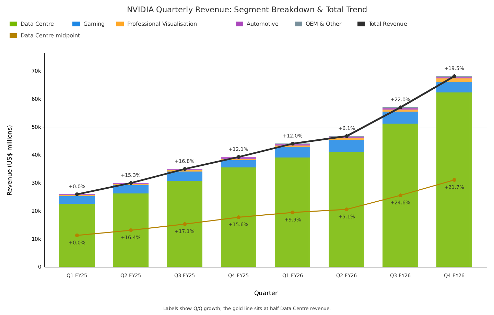
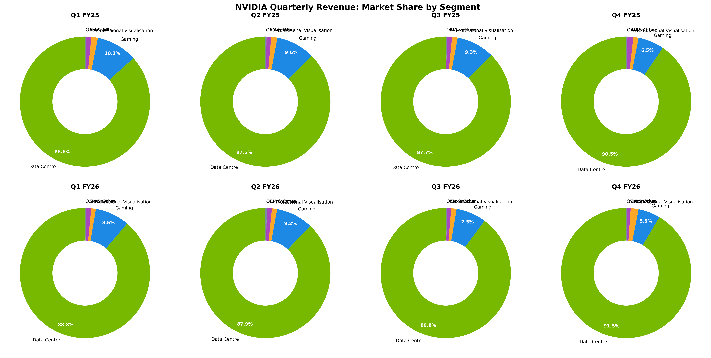
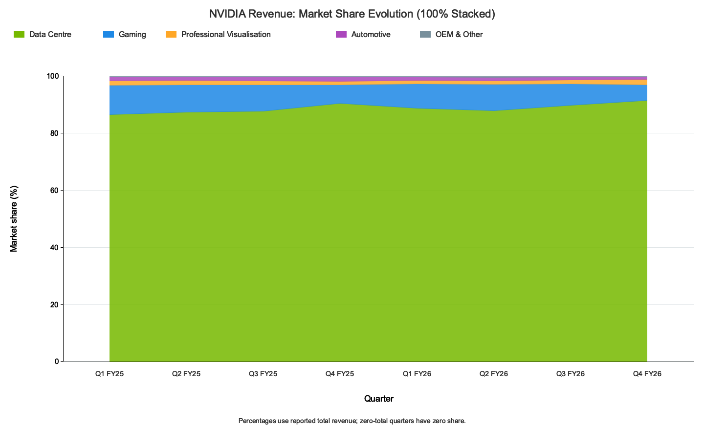
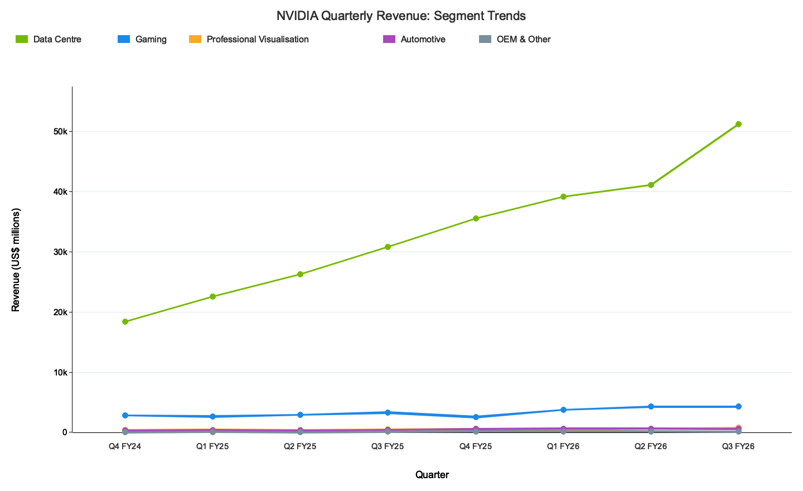
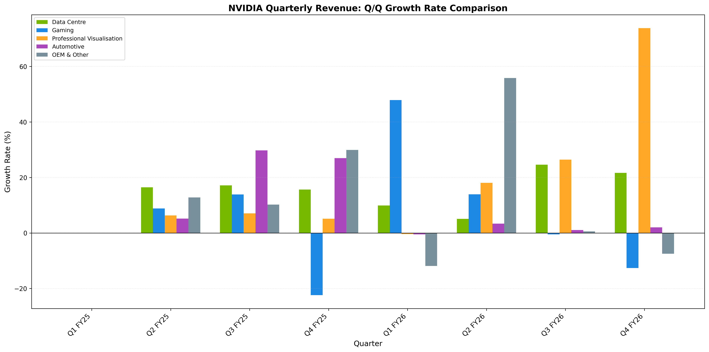
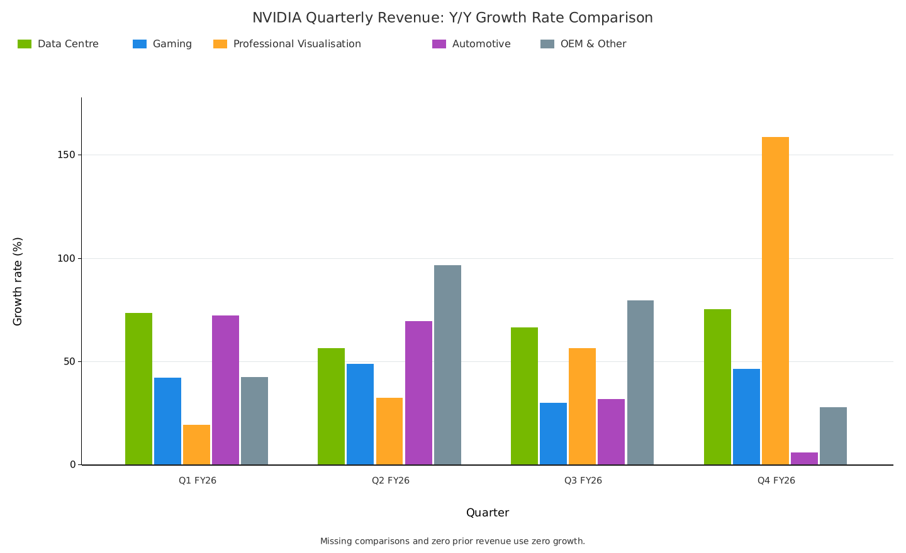
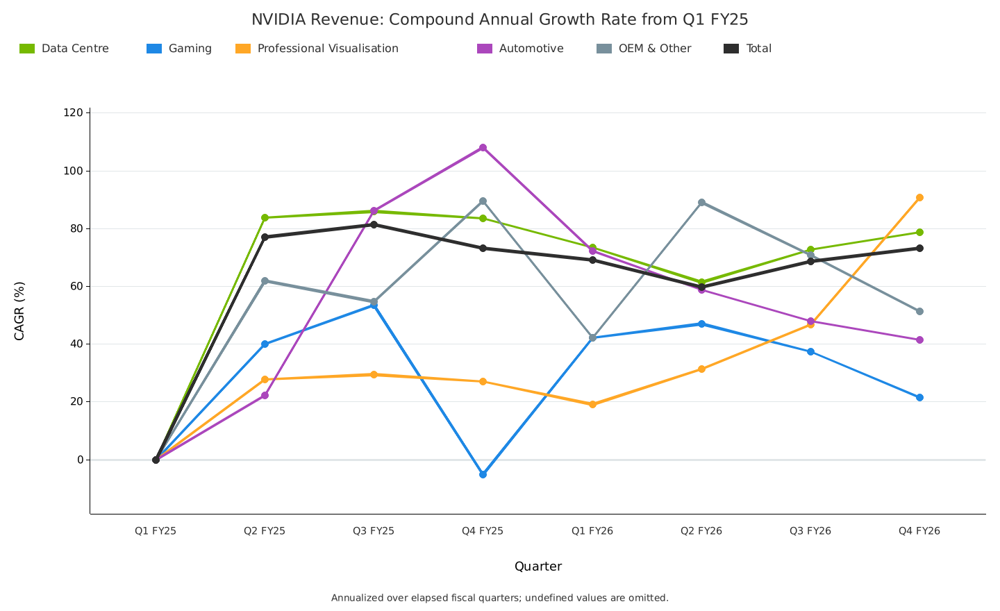
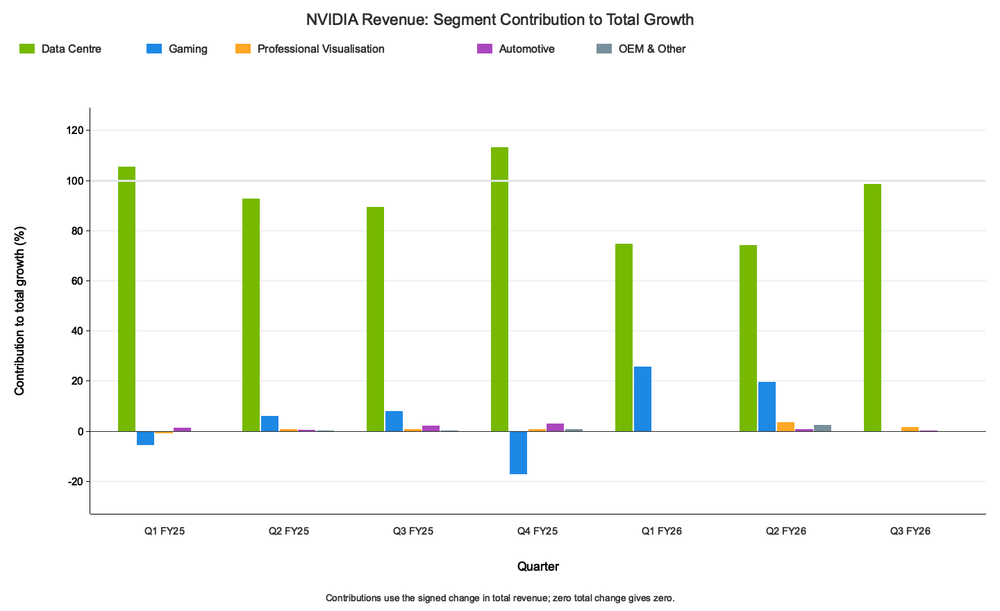
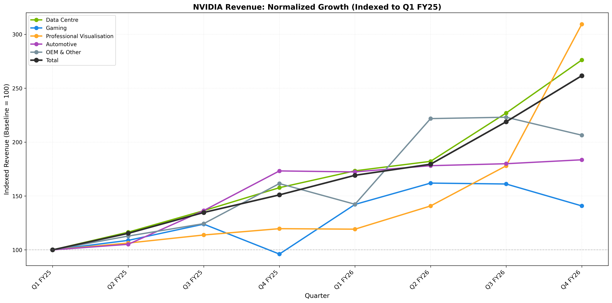

# NVIDIA Quarterly Revenue



A Rust CLI that extracts and visualises NVIDIA's quarterly revenue data from PDF reports. It generates nine PNG charts, stores historical revenue in SQLite, exports CSV and JSON, and supports automated PDF downloads and GitHub releases.

## Features

- Automatically selects the latest quarterly PDF in `data/` using its fiscal quarter and year.
- Extracts five market segments: Data Centre, Gaming, Professional Visualisation, Automotive, and OEM & Other.
- Checks segment totals and calculates Q/Q, Y/Y, and CAGR growth.
- Generates nine charts with the existing filenames and scales the revenue chart to the number of quarters.
- Imports all quarterly PDFs into the existing SQLite schema and exports historical revenue to CSV or JSON.
- Downloads NVIDIA reports, normalises their filenames, and creates quarterly GitHub releases.

## Installation

Install [stable Rust and Cargo](https://www.rust-lang.org/tools/install), a C compiler, and Poppler's `pdftotext`. PNG chart rendering also requires system fonts; Linux builds require Fontconfig development libraries and `pkg-config`.

On Ubuntu/Debian:

```sh
sudo apt-get update
sudo apt-get install -y build-essential pkg-config libfontconfig1-dev fonts-dejavu-core poppler-utils curl
```

On macOS, install the Xcode command-line tools and Poppler using your package manager. macOS supplies system fonts and `curl`.

Build the application with the committed dependency lockfile:

```sh
cargo build --release --locked
```

The executable is `target/release/nvidia-revenue`. Run it directly, or install it onto your Cargo executable path:

```sh
cargo install --path . --locked
```

PDF extraction uses `pdftotext`; downloads use `curl`. The optional `release` command requires an authenticated [GitHub CLI](https://cli.github.com/). SQLite is bundled into the application, so no separate SQLite installation is required. The application does not require a Python runtime.

## Usage

Analyse the latest quarterly PDF and generate all nine charts:

```sh
nvidia-revenue
```

Analyse a specific report:

```sh
nvidia-revenue data/Rev_by_Mkt_Qtrly_Trend_Q326.pdf
```

Set input and chart directories explicitly:

```sh
nvidia-revenue analyse --data-dir data --output-dir charts
nvidia-revenue analyse data/Rev_by_Mkt_Qtrly_Trend_Q326.pdf --output-dir charts
```

Filenames should contain the quarter and two-digit fiscal year, for example `Q226` for Q2 FY26. Use `nvidia-revenue latest --data-dir data` to print the latest report's path.

### Import and export historical revenue

Import every PDF in `data/` into SQLite and update both exports:

```sh
nvidia-revenue batch --import --data-dir data --db data/data.db \
  --csv data/revenue_export.csv --json data/revenue_export.json
```

Export an existing database without importing PDFs:

```sh
nvidia-revenue batch --db data/data.db --csv revenue.csv --json revenue.json
```

The default database is `data/data.db`. Pass `--db` when using a different database path. Existing databases retain their revenue and import-history schema.

### Download reports and create releases

Check the previous, current, and next two fiscal quarters:

```sh
nvidia-revenue download --data-dir data --check-previous 1 --check-future 2
```

Download one specific fiscal quarter:

```sh
nvidia-revenue download --year 2026 --quarter 2 --data-dir data
```

Create a GitHub release for the latest local report, skipping an existing release:

```sh
nvidia-revenue release --data-dir data
```

Use `nvidia-revenue --help` or a subcommand's `--help` for all options. During development, replace `nvidia-revenue` with `cargo run --locked --`, for example `cargo run --locked -- analyse`.

### Output

Analysis prints quarter-over-quarter growth and writes the nine chart PNGs to `charts/` by default. Batch imports and exports are explicit operations; analysing a PDF generates charts without importing it into SQLite.

### 1. Main Revenue Trend (Stacked Bar Chart)


Stacked bars show market-segment revenue, with total and Data Centre trends and growth annotations.

### 2. Market Share Analysis



Quarterly donut charts show the percentage of revenue from each segment.

### 3. Market Share Evolution



A 100% stacked area chart shows how segment proportions change over time.

### 4. Individual Segment Trends



Separate lines show the absolute revenue trajectory of each segment.

### 5. Quarter-over-Quarter Growth Comparison



Grouped bars compare Q/Q growth across market segments.

### 6. Year-over-Year Growth Comparison



Grouped bars compare each quarter with the same fiscal quarter a year earlier.

### 7. Compound Annual Growth Rate (CAGR)



Lines show annualised growth from the baseline quarter to each subsequent quarter.

### 8. Growth Contribution Analysis



Segment contributions explain the change in total revenue between quarters.

### 9. Indexed Growth Comparison



All segments start at an index of 100, making relative growth comparable.

## Development

```sh
cargo fmt --all
cargo fmt --all -- --check
cargo clippy --locked --all-targets -- -D warnings
cargo test --locked
```

Rust tests cover parsing, growth calculations, database compatibility and exports. PDF integration checks require `pdftotext`; chart rendering requires system fonts.

Optional pre-commit hooks add whitespace, merge-conflict, and Rust-formatting checks. If you use the independently installed `pre-commit` development tool:

```sh
pre-commit install
pre-commit run --all-files
```

## Project Structure

```text
nvidia-quarterly-revenue/
├── Cargo.toml              # Rust application manifest
├── Cargo.lock              # Locked dependency versions
├── src/                    # CLI, PDF parser, database, charts and utilities
├── tests/                  # Rust integration tests
├── data/                   # Quarterly PDFs, SQLite database, CSV/JSON exports
├── charts/                 # Nine generated PNG charts
├── .github/workflows/      # Tests, PDF monitoring and scheduled downloads
└── experiments/language-size/  # Historical Go/Rust/Julia prototypes and measurements
```

## Automated Workflows

- **Test** runs formatting, Clippy, and Rust tests on pushes and pull requests.
- **PDF Monitor** processes changed PDFs, updates SQLite and exports, regenerates charts for the latest report, and creates a quarterly release.
- **PDF Downloader** checks for reports every Monday at 09:00 UTC. Manual runs accept `check_previous` and `check_future`. New reports are imported, exported, charted, committed, and released.

Both update workflows stage only the intended revenue files and use the Rust release binary. GitHub provides the GitHub CLI and workflow token for release creation.

## Migration and performance measurements

The earlier [language comparison](experiments/language-size/README.md) measured small equivalent prototypes with one SVG chart. Its size, CPU, and RAM results are historical prototype measurements. The production Rust application adds bundled SQLite, PNG rendering, fonts, and command-line dependencies, so those measurements do not describe the full application.

On macOS ARM64, the complete release executable measured **1.70 MiB**. Processing the eight-quarter Q3 FY26 PDF and generating all nine PNGs took a median **0.22 seconds elapsed**, **215 ms CPU**, and **21.2 MiB peak resident memory**, across 15 fresh-process runs after two warmups. These measurements include Poppler's child process; memory is the largest individual process peak, not summed parent/child usage. The executable size excludes Poppler, fonts and optional external utilities. [Raw production measurements](experiments/language-size/results/production-rust.json) are saved separately from the prototype comparison.

To repeat this measurement after building, use the optional historical Python benchmark harness:

```sh
python3 experiments/language-size/benchmark_resources.py --production-rust
```

PDF data, chart filenames, and the existing SQLite/export formats remain compatible. Chart rendering uses Plotters, so the appearance and PNG bytes differ from the original Matplotlib output. Python remains useful only for reproducing the historical comparison harness.

The downloader also corrects the fiscal-year calculation: NVIDIA's fiscal year is named for the January in which it ends, so February through December belong to the following fiscal year. Explicit `--year` values always refer to the fiscal year.
